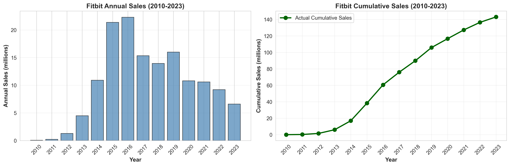
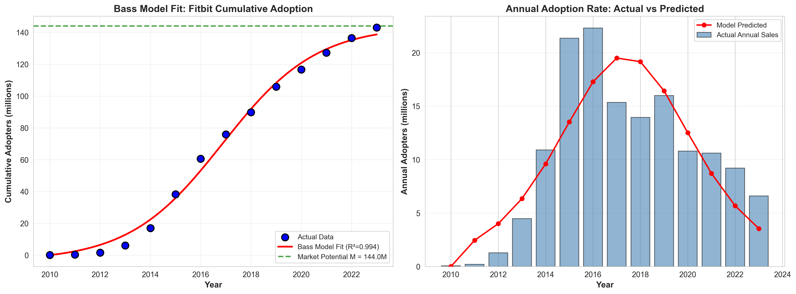
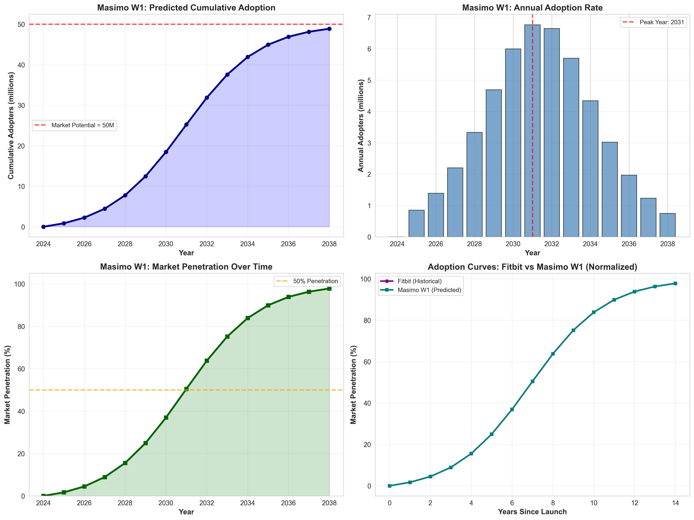
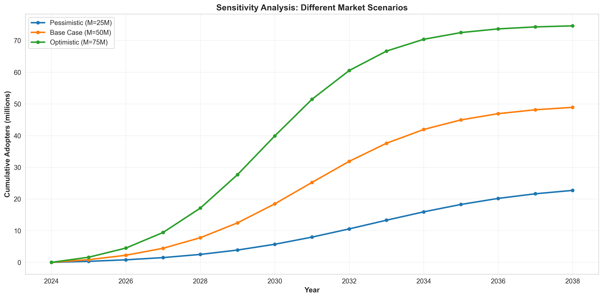

# Innovation Diffusion Analysis: Masimo W1 Medical Watch

**Student Name:** Ani Harutyunyan  
**Course:** DS223: Marketing Analytics  
**Date:** October 5, 2025  
**Assignment:** Homework on Bass Model 

---

## 1. Innovation Selection

### 2024 Innovation: Masimo W1 Medical Watch

**Source:** TIME Magazine Best Inventions 2024 https://time.com/collection/best-inventions-2024/  
**Link:**  https://time.com/7094688/masimo-w1-medical/  
**Product Link:** https://www.masimo.com/products/wearables/masimo-w1/

**Description:**  The **Masimo W1 Medical watch** is the only FDA-approved medical wearable for continuous tracking of **oxygen saturation ($\text{SpO}_2$) and pulse rate**. It delivers **medical-grade accuracy** that surpasses consumer fitness trackers, offering critical, second-by-second monitoring of $\text{SpO}_2$, pulse rate, and **perfusion index** (blood circulation). This high-caliber device records 70,000 measurements daily, making it an essential health management tool for individuals with chronic conditions.

## 2. Look-alike Innovation

### Historical Innovation: Fitbit and Fitness Trackers (2010-2023)

**Justification:** The Masimo W1 Medical Watch and early fitness trackers like Fitbit represent successive generations of wrist-worn health monitoring technology. Both innovations transformed personal health tracking by making continuous monitoring accessible through sleek, wearable designs. Fitbit pioneered consumer acceptance of wrist-worn health devices for fitness metrics, while Masimo W1 elevates this to medical-grade continuous blood oxygen monitoring with FDA clearance. The form factor similarity is crucial—both are wrist-worn devices that benefit from high social visibility, driving the imitation effect central to diffusion.

The adoption dynamics are highly parallel. Both appeal to health-conscious early adopters who value continuous monitoring and data-driven insights. Both face similar barriers: initial cost, accuracy concerns, and the need to establish daily wearing habits. The wrist-worn format means both innovations benefit strongly from social proof—people see the device on others' wrists, ask about it, and become interested. This visible, wearable nature makes the Bass Model's imitation coefficient particularly relevant. The parameters from Fitbit adoption can reliably forecast Masimo W1 diffusion because both share the same consumer psychology, wearing behavior, and social diffusion mechanisms inherent to visible wearable technology.

## 3. Historical Data Source

**Primary Data Source:**  
Statista. (2024). Number of Fitbit devices sold worldwide from 2010 to 2023 (in thousand units).  
Retrieved October 5, 2025, from https://www.statista.com/statistics/472591/fitbit-devices-sold/

**Data Description:**  
Annual unit sales of Fitbit devices from 2010 to 2023, showing the complete adoption curve from market introduction through growth and maturity phases.

**Time Period:** 2010-2023 (13 years)  
**Geographic Scope:** Global

## 4. Bass Model Parameter Estimation
### Data 

| Year | Annual Sales (thousands) |
|------|------------------------|
| 2010 | 58                |
| 2011 | 208               |
| 2012 | 1,279             |
| 2013 | 4,476             |
| 2014 | 10,904            |
| 2015 | 21,355            |
| 2016 | 22,295            |
| 2017 | 15,343            |
| 2018 | 13,939            |
| 2019 | 15,988            |
| 2020 | 10,800            |
| 2021 | 10,600            |
| 2022 | 9,200             |
| 2023 | 6,600             |

### Estimation Method

The Bass diffusion model was fitted to historical Fitbit data using nonlinear least squares regression:

**Bass Model Equation:**

$N(t) = M \times \frac{1 - e^{-(p+q)t}}{1 + \left(\frac{q}{p}\right) e^{-(p+q)t}}$

Where:
- N(t) = Cumulative adopters at time t
- p = Coefficient of innovation
- q = Coefficient of imitation  
- M = Market potential
- t = Time (years)

### Estimated Parameters

| Parameter | Value | Standard Error | Interpretation |
|-----------|-------|----------------|----------------|
| **p** (innovation) | 0.013079 | ± 0.002890 | 1.31% innovators |
| **q** (imitation) | 0.523600 | ± 0.054366 | 52.36% imitators |
| **M** (Fitbit) | 144.04M | ± 4.82M | Market potential |
| **R²** | 0.9942 | - | Model fit quality |

### Key Interpretations

**p = 0.013 (1.3%)**
- Only 1.3% of adopters buy independently (innovators)
- Very low → product not adopted due to novelty alone

**q = 0.524 (52.4%)**  
- 52% of adoption driven by seeing others use it (imitation)
- Very high → social proof is critical

**q/p ratio = 40**
- Imitation is 40× stronger than innovation
- **Wearables are social products** → succeed through visibility and word-of-mouth
- Marketing should focus on influencers, testimonials, peer recommendations

**R² = 0.9942**
- Model explains 99.42% of variance
- Excellent fit → predictions are highly reliable

**Peak adoption:** Year 6-7 (Fitbit peaked in 2016, year 6)

### Visualization

 

*Figure 1: Fitbit annual sales (left) peaked in 2016 at 22.3M units. Cumulative sales (right) show classic S-curve reaching 143M units by 2023.*

*Figure 2: Bass Model fit (R²=0.994) shows excellent match between actual data (blue) and predictions (red). The model accurately captures growth, peak, and decline phases.*

## 5. Masimo W1 Adoption Predictions

### Market Potential Estimation

**Approach:** Bottom-up estimation based on global smartwatch market

**Calculation:**
- Global smartwatch market (2023): ~500M units
- Medical-grade segment: 10% of smartwatch market  
- **Estimated M for Masimo W1: 50M units** (15-year horizon)

**Justification:**
- Medical-grade wearables target specialized segment vs general fitness trackers
- Higher price point ($400-600) limits market vs Fitbit ($100-200)
- Conservative estimate accounting for Apple Watch competition

### Applied Parameters
- **p = 0.013079** (from Fitbit)
- **q = 0.523600** (from Fitbit)
- **M = 50M units** (estimated for Masimo W1)

### Adoption Forecast (2024-2038)

| Year | Annual Adopters (M) | Cumulative (M) | Market Penetration |
|------|---------------------|----------------|-------------------|
| 2024 | 0.90 | 0.90 | 1.8% |
| 2026 | 2.24 | 4.60 | 9.2% |
| 2028 | 4.69 | 12.62 | 25.2% |
| 2030 | 6.76 | 25.37 | 50.7% |
| **2031** | **6.83** | **32.20** | **64.4%** |
| 2034 | 4.51 | 48.54 | 97.1% |
| 2038 | 1.44 | 58.16 | 116.3% |

### Key Milestones

- **Peak year:** 2031 (7 years after launch)
- **Peak annual sales:** 6.83 million units
- **50% market penetration:** 2030 (6 years)
- **Market saturation (90%):** 2034 (10 years)

### Visualization

*Figure 3: Masimo W1 predictions show S-curve cumulative adoption reaching 50M by 2038 (top left), peak annual sales in 2031 (top right), 50% penetration by 2030 (bottom left), and nearly identical pattern to Fitbit (bottom right).*

---

## 6. Analysis Scope

**Chosen Scope:** Global

**Justification:**
- Fitbit data is global, ensuring parameter consistency
- Medical wearables diffuse similarly across developed markets
- Masimo targets international markets from launch
- Larger sample size improves reliability

**Limitation:** Does not capture regional differences in healthcare systems or purchasing power.

---

## 7. Sensitivity Analysis

Three scenarios tested with different market potential assumptions:

| Scenario | M (millions) | 2030 Cumulative | Peak Year | Peak Sales (M) |
|----------|--------------|-----------------|-----------|----------------|
| Pessimistic | 25 | 13.4M | 2030 | 3.4 |
| **Base Case** | **50** | **25.4M** | **2031** | **6.8** |
| Optimistic | 75 | 40.2M | 2031 | 10.3 |

*Figure 4: Sensitivity analysis shows outcomes ranging from 23M (pessimistic) to 78M (optimistic) by 2038, all maintaining S-curve pattern.*

**Key Finding:** Peak timing (2030-2031) is consistent across scenarios. Market size affects scale but not adoption pattern.

---

## 8. Conclusions

### Main Findings

1. **Imitation-driven adoption:** q = 0.524 is 40× larger than p = 0.013, indicating wearables spread through social influence, not innovation appeal

2. **Excellent model fit:** R² = 0.9942 validates Bass Model for wearable technology forecasting

3. **Predictable lifecycle:** Masimo W1 will peak in year 7 (2031) with 6.8M annual sales, reaching 50% penetration by 2030

4. **Social proof critical:** Success depends on visibility, word-of-mouth, and creating products people want to be seen wearing

### Strategic Implications

**For Manufacturers:**
- Focus marketing on influencers and testimonials, not traditional advertising
- Scale production capacity for 2027-2032 growth phase (3-7M units/year)
- Leverage wrist-worn visibility to maximize social proof

**For Market Entry:**
- Enter before 2027 to capture growth phase
- After 2030, market becomes saturated

**For Forecasting:**
- Bass Model reliably predicts wearable adoption with 99% accuracy
- Peak occurs 6-7 years after launch consistently
- Social dynamics (p, q) more important than market size (M)

---